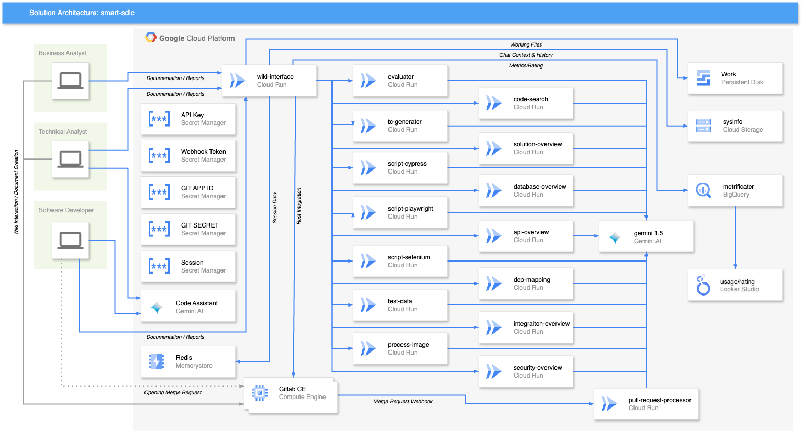
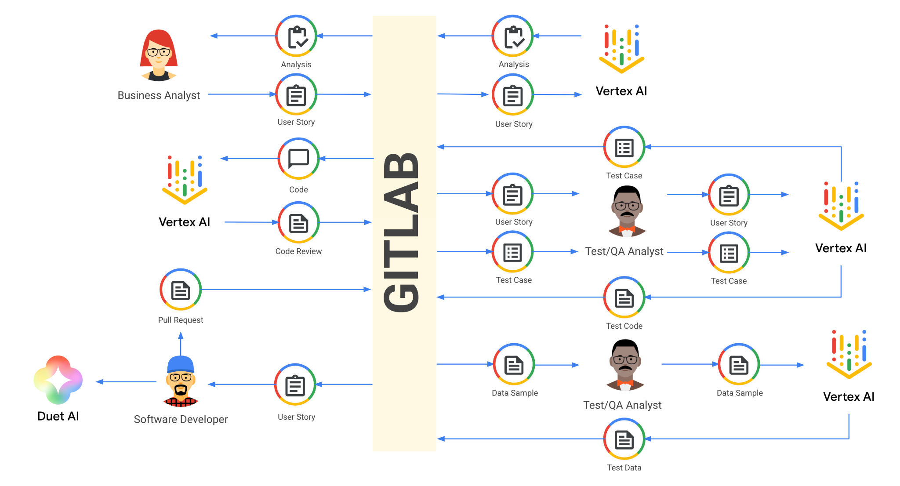
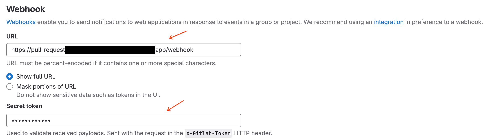

# Overview

This repository provides a tool set and a deployment guide showcasing the usage of **Vertex AI / Gemini** in a complete Software Development Life Cycle process, using Gitlab as the main Documentation and Source Code repository.  The solution showcases the User Story document evaluation, Test Case document creation based on User Story document (the screen prototype is also evaluated), Test Script creation based on Test Case document, Bulk Test Data creation, and also Code Changes review submitted to the repository.  
This repository is organized in subprojects, each of them with its own detailed documentation on the setup and deployment.  
Prompts for each of the components are provided in English and Brazilian Portuguese, and may be customized as needed.

**WARNING**  
**PII**: Testing data model may not generate valid PII data like SSN. (Sometimes it may even fail to generate any data at all, even invalid ones).

## Architecture

The organization of the components on the platform is detailed below:  

As the diagram shows, the solution relies heavily on Google Cloud Run. There is also the presence of Secret Manager to hold few of the secrets necessary for integration between multiple components. Of course, we have Vertex AI APIs as well and a BigQuery to hold metrics and rating.

| Component         | Details                                                                                       |
|:-----------------:|:----------------------------------------------------------------------------------------------|
| wiki-interface    | Web interface to integrate Gitlab Wiki to our services                                        |
| evaluator         | Node.js Service that receives User Story and returns evaluation                               |
| tc-generator      | Node.js Service that receives User Story and returns a Test Case document                     |
| script-cypress    | Node.js Service that receives Test Case and returns a Test Script in Cypress                  |
| script-playwright | Node.js Service that receives Test Case and returns a Test Script in Playwright               |
| test-data         | Node.js Service that receives Sample CSV Data and QTY, and returns bulk testing data          |
| pull-request      | Node.js Service that receives Webhook calls from Gitlab/Github and evaluates change           |
| image-processor   | Node.js Service that receives json input with screen prototype data and returns image details |

Each of the described components is built into its own container. Details for each of them are provided in their respective folders.   
There are two main integration points to Gitlab, the **wiki-interface** component and the **pull-request** component.  
The **wiki-interface** component is basically some HTML Form + Javascript that reads the Wiki Page list from Gitlab, and writes back to Gitlab the results. If you wish to integrate to any other system, you can use this component as an starting point.  
The **wiki-interface** is also responsible for storing document generation metrics as well as result rating to **BigQuery**.  
The **pull-request** component is a Rest service that receives Webhook calls and integrates to the Repository to read data and write feedback. As-is, this component supports Gitlab and Github.

## Personas

The proposed solution works with three different personas.

* Business Analyst  
  Business Analyst writes user story and submits to Gitlab.  
  Business Analyst uses **wiki-integration** to execute an evaluation through **evaluator**.  
  **evaluator** invokes **Vertex AI** with our prompt to get the results.  
  **wiki-integration** gets the result from **evaluator** and submits to **Gitlab Wiki**.

* Test/QA Analyst  
  Test/QA Analyst reviews User Story document and submits to **tc-generator** using **wiki-integration**.
  **wiki-integration** detects if the input document has any images and sends them to **image-processor**.
  **image-processor** uses Vertex AI to generate Image/Screen details.
  **wiki-interface** adjusts the input document replacing the images with its details in text.
  **tc-generator** uses Vertex AI to generate a Test Case document based on User Story document and image details.  
  **wiki-integration** gets the results and submits to **Gitlab Wiki**.  
  Test/QA Analyst reviews Test Case document and using **wiki-integration** submits it to one of our **script** components.  
  **script** component invokes **Vertex AI** to generate a Test Script in Cypress or Playwright.  
  **wiki-integration** gets the result from **script** component and submits to **Gitlab Wiki**.  
  Test/QA Analyst reviews and adapts Test Script using **Duet AI** and saves final version.
  Test/QA Analyst submits sample CSV data to **test-data** using **wiki-integration**.
  **test-data** uses Vertex AI to generate Bulk Test Data based on sample provided.

* Software Developer  
  Software Developer reviews User Story document and writes code with help of **Duet AI**.  
  Software Developer opens a Pull/Merge Request to **Gitlab**.  
  **Gitlab** invokes our **Webhook** to evaluate the change proposed using **Vertex AI**.  
  **Webhook** comments back to the proposed review with change evaluation.  

## Gitlab
The proposed deployment uses Gitlab as its main repository for holding both, Wiki Pages and Source Code.  
This solution doesn't plan to cover Gitlab setup and provisioning. There are multiple ways to achieve that. To mention a few:
* Google Cloud Marketplace
* Gitlab Official Documentation
* [click-to-deploy](https://github.com/GoogleCloudPlatform/click-to-deploy/tree/master/k8s/gitlab)
* Install Gitlab CE in a single Compute Engine instance

## Installation

Each component of the solution has a deployment/installation guide on its subdirectory.  

**IMPORTANT:** 
* There are resources that are shared between multiple components, like Secret Manager entries.
* Pay attention not to recreate those shared components and break the solution.

## Documentation

Almost each component of the solution has a README.md file with details about it.  
There is also a TLDR.md file on each component for those that are in a hurry.  

## Wiki Integration

The integration of Gitlab Wiki with your solution is done through **wiki-interface** component. To enable it, you must go into your project settings and enable **External wiki** integration.  

The URL must be in the following format: https://cloud-run-url/webui/:project-id .  
You can get the your Gitlab Project Id going to **Settings**, **General**:

## Webhook Integration

To setup Gitlab's Webhook, go to **Settings**, **Webhooks**, and add a new Webhook:

The URL must be in the following format: https://cloud-run-url/webhook .  
The Secret Token must match the token that you are using on Secret Manager.
  
Select **Comments** and **Merge Request events** on the checkboxes:  

## Contributing

Check [CONTRIBUTING.md](CONTRIBUTING.md) file.